<p align="center">
  <a href="https://www.linkedin.com/in/mihir-choudhary/"></a>
  <a href="mailto:mihirsinghchoudhary777@gmail.com"></a>
  <a href="https://github.com/Mihir-Choudhary?tab=repositories"></a>
</p>


<br>

## ▍whoami

DFIR analyst at **Tata Consultancy Services**, running end-to-end investigations across Windows, Linux, mobile and cloud. Forensic acquisition of endpoints, EC2 snapshots, EBS volumes and memory dumps; malware analysis and reverse engineering; Active Directory and server compromise; cloud account compromise and misuse.

Most of my time goes into correlating logs and telemetry into an attack timeline that actually holds up. When a tool doesn't exist for the artifact in front of me, I write one — that's where everything below came from.

```yaml
disk_forensics:   E01 / AFF4 / RAW acquisition · NTFS artifacts · registry · prefetch · timeline reconstruction
memory_forensics: Volatility 3 · process & handle analysis · injected code · API hook detection
mobile_forensics: Cellebrite UFED · manual SQLite carving · deleted-record recovery · Indian fintech apps
cloud_forensics:  EC2 snapshot acquisition · EBS imaging · CloudTrail & VPC Flow Logs · OneDrive / GDrive
malware_analysis: Ghidra · IDA Pro · static & dynamic triage · reverse engineering
automation:       parser development · AI-assisted analysis · scripting
```

<br>

## ▍Tooling I've Built

<table>
<tr>
<td width="33%" valign="top">

### [EventHawk](https://github.com/Mihir-Choudhary/EventHawk)


Windows **EVTX log analysis** for DFIR — fast parsing, ATT&CK mapping, IOC extraction and Sentinel anomaly detection.

*Juggernaut Mode* (Arrow/DuckDB) chews through 10M+ events.

</td>
<td width="33%" valign="top">

### [Android-PhonePe-Forensics](https://github.com/Mihir-Choudhary/Android-Phonepe-Forensics)


Forensic parser and analysis dashboard for **PhonePe Android** extractions.

Recovers deleted records straight out of the SQLite stores.

</td>
<td width="33%" valign="top">

### [Paytm-Forensics](https://github.com/Mihir-Choudhary/Paytm-Forensics)


Offline parser for the **Paytm Android** app (`net.one97.paytm`).

Read-only by construction — never writes to evidence.

</td>
</tr>
</table>

<br>

## ▍Upstream Contributions

Contributions to the forensic tools the DFIR community runs every day.

| | Contribution | Project |
| :--- | :--- | :--- |
|  | [`--ads` switch to scan alternate data streams for hidden prefetch](https://github.com/EricZimmerman/PECmd/pull/17) | **PECmd** — Eric Zimmerman's EZ Tools |
|  | [`windows.malware.apihooks` plugin for Windows API hook detection](https://github.com/volatilityfoundation/volatility3/pull/1968) | **Volatility 3** |

<br>

## ▍Arsenal

<table>
<tr><td><b>Forensic&nbsp;Suites</b></td><td>


</td></tr>
<tr><td><b>Malware&nbsp;&amp;&nbsp;RE</b></td><td>


</td></tr>
<tr><td><b>Disciplines</b></td><td>


</td></tr>
<tr><td><b>Platforms&nbsp;&amp;&nbsp;Code</b></td><td>


</td></tr>
</table>

<br>

## ▍Credentials


<br>

<details>
<summary><b>▍ Case history — experience &amp; education</b></summary>

<br>

**Digital Forensic Analyst** · Tata Consultancy Services · Hyderabad, India · *07/2025 – Present*

- Digital forensics investigations across multiple operating systems: DLP incidents, server compromises, breaches and malware intrusions
- Ransomware outbreaks and Domain Controller breaches — rapid triage, evidence acquisition, malware analysis and attack-timeline reconstruction to drive containment and remediation within SLA
- Cloud forensics: EC2 snapshot acquisition, EBS volume imaging, memory dumps, CloudTrail and VPC Flow Log analysis
- Malware analysis and reverse engineering with Ghidra and IDA Pro
- Forensic tool assessment for a German financial firm post-cyberattack — evaluated the environment and IR process, identified gaps, recommended improvements to forensics, IR and threat hunting
- Mobile forensics with Cellebrite UFED plus manual SQLite parsing for complex cases; custom tooling for Indian apps to uncover fraud patterns
- Forensically sound image acquisition (E01, AFF4, RAW) of laptops, desktops and servers
- Cloud account acquisitions for OneDrive and Google Drive in compromise and data-theft investigations
- Strict evidence handling, chain of custody, secure storage and documentation at every stage

**Cybersecurity Intern** · Requin Solutions Pvt Ltd · Jaipur, India · *08/2023 – 04/2024*

- SIEM tuning: rule adjustment and alert-relevance improvement
- SIEM agent deployment and configuration for reliable log collection
- Built SIEM use cases for login monitoring, endpoint events and anomaly detection
- Vulnerability assessment with Nessus and Nmap; prioritised findings by cost-impact and recommended remediation

**B.Tech, Computer Science and Engineering** *(Cyber Security)* · Vellore Institute of Technology · 2021 – 2025 · CGPA 8.3/10

</details>

<br>

<p align="center">
  <sub>Always up for a conversation about DFIR, forensic tooling and parser development.</sub><br>
  <a href="https://www.linkedin.com/in/mihir-choudhary/"></a>
  <a href="mailto:mihirsinghchoudhary777@gmail.com"></a>
</p>
